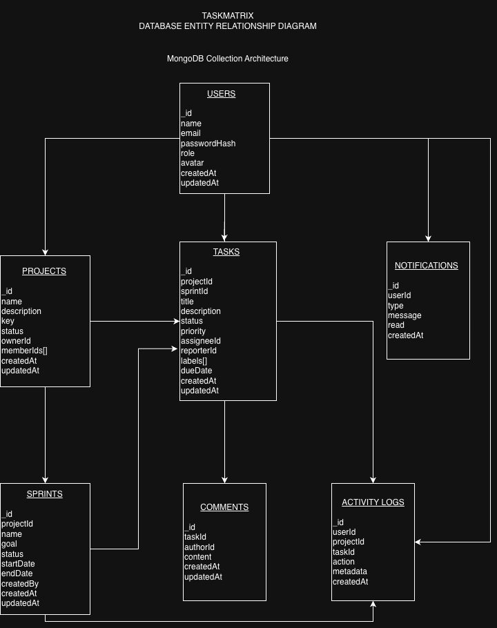
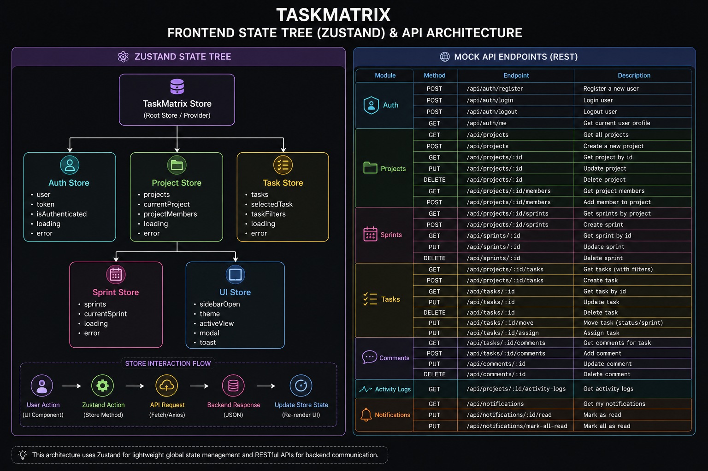

# TaskMatrix — Enterprise Agile Project Management Platform

> **Prodesk IT — Sprint 13 Capstone Project**

TaskMatrix is a full-stack Agile project management platform designed to help software teams plan projects, organize sprints, manage tasks, collaborate with team members, and monitor project progress from a centralized workspace.

## Project Information

| Field | Details |
|---|---|
| Project Name | TaskMatrix |
| Project Type | Enterprise Agile Project Management Platform |
| Designated Track | Full-Stack / Frontend Engineering |
| Development Phase | Sprint 13 — Planning & Architecture |
| Repository | [prodesk-capstone-taskmatrix](https://github.com/nishantsharma275g-ai/prodesk-capstone-taskmatrix) |
| Current Status | Sprint 13 Planning Complete |

## Product Vision

TaskMatrix provides software development teams with a centralized platform for managing projects, tasks, sprints, team members, and project activity.

## Problem Statement

Software teams often use multiple tools to manage different parts of their development workflow. Common challenges include:

- Difficulty tracking project progress
- Scattered task information
- Poor visibility into sprint progress
- Manual team workload tracking
- Limited project activity visibility
- Lack of centralized project analytics

TaskMatrix addresses these problems by providing a unified workspace for project and Agile workflow management.

## Target Users

### Admin
- Manage users
- Manage projects
- Assign user roles
- View organization-wide analytics
- Manage system settings

### Project Manager
- Create and manage projects
- Create and manage sprints
- Create and assign tasks
- Manage project members
- Monitor sprint progress
- View project analytics

### Developer
- View assigned tasks
- Update task status
- Update task information
- Add comments
- Track sprint progress

### Team Member
- View assigned projects
- View assigned tasks
- Update permitted task information
- Add comments
- View project activity

## Feature Prioritization

### P0 — Mandatory MVP

**Authentication**
- User login
- User logout
- Protected routes
- Session management

**User Management**
- User profiles
- User roles
- Role-based access

**Projects**
- Create project
- View projects
- Project details
- Project members

**Tasks**
- Create task
- Edit task
- Delete task
- Assign task
- Change task status
- Set task priority

**Kanban Board**
- Backlog
- To Do
- In Progress
- Done

**Data Persistence**
- MongoDB database
- API integration
- Persistent project and task data

### P1 — Priority Features

**Sprint Management**
- Create sprint
- Start sprint
- Complete sprint
- Sprint backlog
- Sprint progress tracking

**Team Management**
- Add team members
- Assign project roles
- View team workload

**Task Details**
- Task descriptions
- Comments
- Labels
- Due dates
- Activity history

**Search & Filtering**
- Status
- Priority
- Assignee
- Sprint
- Label

**Dashboard Analytics**
- Completed vs pending tasks
- Sprint progress
- Task distribution
- Team workload
- Project activity

### P2 — Stretch Goals

- Notifications
- Advanced analytics
- Audit logs
- Drag-and-drop task management
- Optimistic UI updates
- Keyboard shortcuts
- Advanced permissions
- Dark mode
- Advanced search
- Pagination
- Enhanced mobile experience

## Core Application Views

### Authentication
- Login
- Session handling
- Error states
- Loading states

### Main Dashboard
- Total projects
- Active projects
- Active sprint
- Open tasks
- Completed tasks
- Sprint progress
- Team workload
- Recent activity

### Project Details
- Overview
- Team
- Backlog
- Sprints
- Kanban board
- Analytics
- Activity

### Kanban Board

```text
Backlog → To Do → In Progress → Done
```

### Task Details
- Title
- Description
- Status
- Priority
- Assignee
- Reporter
- Sprint
- Labels
- Due date
- Comments
- Activity history

## System Architecture

```text
┌─────────────────────────────────────┐
│            Next.js Frontend         │
│                                     │
│ Dashboard • Projects • Tasks        │
│ Sprints • Team • Analytics          │
└──────────────────┬──────────────────┘
                   │
                   ▼
┌─────────────────────────────────────┐
│          Application / API          │
│                                     │
│ Authentication                      │
│ Authorization                       │
│ Business Logic                      │
│ Validation                          │
└──────────────────┬──────────────────┘
                   │
                   ▼
┌─────────────────────────────────────┐
│              MongoDB                │
│                                     │
│ Users • Projects • Sprints          │
│ Tasks • Comments • Notifications    │
│ Activity Logs                       │
└─────────────────────────────────────┘
```

## Database Architecture

TaskMatrix is planned around these MongoDB collections:

```text
users
projects
sprints
tasks
comments
notifications
activityLogs
```

### High-Level Relationships

```text
Users
 │
 ├── Projects
 │     ├── Sprints
 │     │     └── Tasks
 │     └── Project Members
 │
 ├── Tasks
 ├── Comments
 ├── Notifications
 └── Activity Logs

Tasks
 ├── Comments
 └── Activity Logs
```

### Entity Relationship Diagram



## Frontend State Architecture

TaskMatrix will use **Zustand** for centralized application-level state management.

```text
Zustand Store
│
├── Auth Store
├── Project Store
├── Task Store
├── Sprint Store
└── UI Store
```

### Auth Store

```text
user
token
isAuthenticated
loading
error
```

### Project Store

```text
projects
currentProject
projectMembers
loading
error
```

### Task Store

```text
tasks
selectedTask
taskFilters
loading
error
```

### Sprint Store

```text
sprints
currentSprint
loading
error
```

### UI Store

```text
sidebarOpen
theme
activeView
modal
toast
```

### Frontend State Tree & API Architecture



## Mock API Endpoints

### Authentication

```text
POST   /api/auth/register
POST   /api/auth/login
POST   /api/auth/logout
GET    /api/auth/me
```

### Users

```text
GET    /api/users
GET    /api/users/:id
PUT    /api/users/:id
DELETE /api/users/:id
```

### Projects

```text
GET    /api/projects
POST   /api/projects
GET    /api/projects/:id
PUT    /api/projects/:id
DELETE /api/projects/:id
```

### Sprints

```text
GET    /api/projects/:id/sprints
POST   /api/projects/:id/sprints
GET    /api/sprints/:id
PUT    /api/sprints/:id
DELETE /api/sprints/:id
```

### Tasks

```text
GET    /api/projects/:id/tasks
POST   /api/projects/:id/tasks
GET    /api/tasks/:id
PUT    /api/tasks/:id
DELETE /api/tasks/:id
PUT    /api/tasks/:id/move
PUT    /api/tasks/:id/assign
```

### Comments

```text
GET    /api/tasks/:id/comments
POST   /api/tasks/:id/comments
```

### Activity Logs

```text
GET    /api/projects/:id/activity-logs
```

### Notifications

```text
GET    /api/notifications
PUT    /api/notifications/:id/read
```

These endpoints represent the planned API contract and may evolve during implementation.

## Technology Stack

| Area | Technology |
|---|---|
| Frontend | Next.js, React |
| Styling | Tailwind CSS |
| State Management | Zustand |
| Backend | Next.js API / Server-side functionality |
| Database | MongoDB |
| Authentication | Auth.js |
| Data Visualization | Recharts |
| Testing | Jest, React Testing Library |
| UI/UX Design | Figma |
| Architecture | Draw.io |
| Version Control | Git, GitHub |
| Deployment | Vercel |

## UI/UX Design

The interface will follow a modern enterprise dashboard design focused on clarity, accessibility, responsiveness, and efficient project-management workflows.

### Core Wireframes

The Sprint 13 Figma design contains the required three core viewports:

1. Authentication Screen
2. Main Dashboard
3. Project / Task Details View

Additional planned views include:

- Kanban Board
- Sprint Management
- Team Management
- Analytics
- User Profile

### Figma Design

**Status:** Completed

[Open TaskMatrix UI/UX Design in Figma](https://www.figma.com/design/Fl5K12wHsa148slrXr9JPX/TaskMatrix-%E2%80%94-UI-UX-Design?node-id=5-9&t=Oywjqlpi9QSljyd3-1)

## Testing Strategy

Testing will be introduced during the implementation phase.

### Unit Testing
- Utility functions
- State management
- Business logic

### Component Testing
- Forms
- Buttons
- Cards
- Task components
- Dashboard components

### Integration Testing
- Authentication flow
- Project creation
- Task creation
- Sprint workflows
- API integration

### Quality Checks
- ESLint
- Responsive testing
- Accessibility testing
- Production build testing

## Security Considerations

Planned measures include:

- Protected routes
- Role-based authorization
- Server-side validation
- Input validation
- Secure authentication
- Environment variables for secrets
- No hardcoded API keys
- Controlled database access

## Responsive Design

TaskMatrix will support:

- Desktop
- Tablet
- Mobile

The primary experience will be optimized for desktop project-management workflows while maintaining usability on smaller screens.

## Deployment Plan

```text
Local Development
       ↓
GitHub
       ↓
Vercel
       ↓
Production
```

### GitHub Repository

[TaskMatrix GitHub Repository](https://github.com/nishantsharma275g-ai/prodesk-capstone-taskmatrix)

### Live Website

**Coming Soon**

Application implementation and production deployment will be completed during the subsequent development phase.

## Development Roadmap

### Week 13 — Product Planning, Architecture & UI/UX

- [x] Select TaskMatrix
- [x] Define product vision
- [x] Define problem statement
- [x] Define target users
- [x] Define user roles
- [x] Define P0, P1 and P2 features
- [x] Create PRD
- [x] Create Figma wireframes
- [x] Create public Figma file
- [x] Add Figma link to README
- [x] Design MongoDB ERD
- [x] Add ERD to README
- [x] Design Zustand state tree
- [x] Define mock API endpoints
- [x] Create frontend architecture diagram
- [x] Add frontend architecture diagram to README
- [x] Complete Sprint 13 planning and architecture

### Week 14 — Application Foundation

- [ ] Initialize Next.js application
- [ ] Configure Tailwind CSS
- [ ] Configure MongoDB
- [ ] Implement authentication
- [ ] Implement role-based authorization
- [ ] Build application layout
- [ ] Build dashboard foundation

### Week 15 — Core Features

- [ ] Project management
- [ ] Task management
- [ ] Kanban board
- [ ] Sprint management
- [ ] Team management
- [ ] Task details
- [ ] Search and filtering

### Week 16 — Optimization & Deployment

- [ ] Analytics
- [ ] Notifications
- [ ] Activity logs
- [ ] Testing
- [ ] Accessibility improvements
- [ ] Performance optimization
- [ ] Production deployment
- [ ] Final documentation
- [ ] Project presentation video

## Sprint 13 Deliverables

### Product Planning

- [x] Product vision
- [x] Problem statement
- [x] Target users
- [x] User roles
- [x] Feature prioritization
- [x] PRD

### UI/UX

- [x] Authentication wireframe
- [x] Main dashboard wireframe
- [x] Project / task details wireframe
- [x] Public Figma file
- [x] Figma link added to README

### Backend Architecture

- [x] MongoDB collection planning
- [x] Entity Relationship Diagram
- [x] Collection relationships
- [x] Mock API endpoint planning

### Frontend Architecture

- [x] Zustand state tree
- [x] Auth Store
- [x] Project Store
- [x] Task Store
- [x] Sprint Store
- [x] UI Store
- [x] Mock API endpoints
- [x] Frontend architecture diagram

## Project Success Criteria

TaskMatrix will be considered successful when the application can:

- Authenticate users
- Enforce user roles
- Create and manage projects
- Create and manage tasks
- Assign tasks to users
- Manage task statuses
- Manage sprints
- Display projects through a Kanban workflow
- Persist data using MongoDB
- Provide useful project analytics
- Run successfully in production
- Maintain a responsive and accessible interface

## Sprint 13 Submission

### GitHub Repository

[TaskMatrix GitHub Repository](https://github.com/nishantsharma275g-ai/prodesk-capstone-taskmatrix)

### Figma Design

[TaskMatrix UI/UX Design](https://www.figma.com/design/Fl5K12wHsa148slrXr9JPX/TaskMatrix-%E2%80%94-UI-UX-Design?node-id=5-9&t=Oywjqlpi9QSljyd3-1)

### Live Website

**Coming Soon**

### Presentation Video

A 2–3 minute Sprint 13 walkthrough video will be recorded for submission.

## Future Improvements

Potential future versions may include:

- Real-time collaboration
- WebSocket notifications
- Calendar integration
- GitHub integration
- Slack integration
- Advanced reporting
- AI-assisted task generation
- AI sprint planning
- Time tracking
- Custom workflows
- Enterprise organization management

## Project Status

**Current Phase:** Sprint 13 — Product Planning, System Architecture & UI/UX Design

**Current Status:** Sprint 13 Planning Complete

The TaskMatrix product requirements, feature priorities, UI/UX wireframes, MongoDB database architecture, Zustand state architecture, and mock API architecture have been established.

Application implementation and production deployment will be completed during the subsequent development phases.

## License

This project is created for educational and portfolio purposes as part of the Prodesk IT internship/capstone program.
